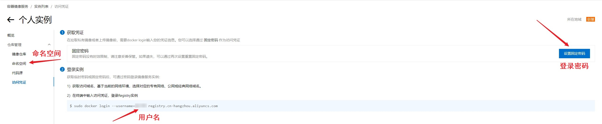
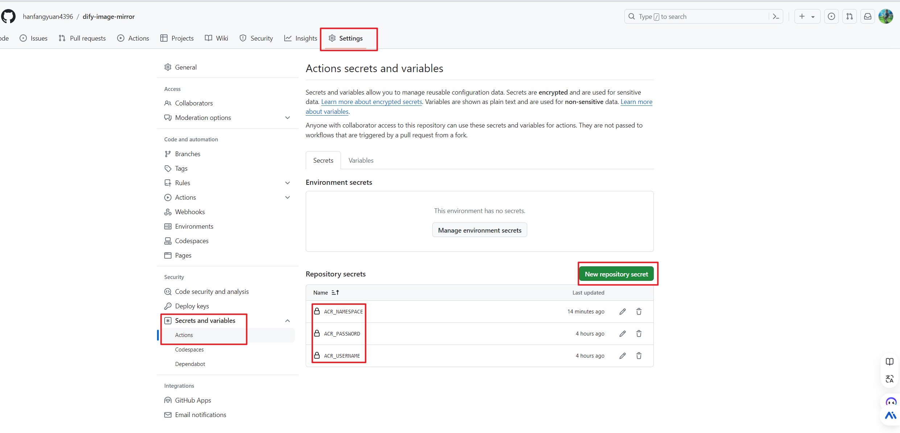
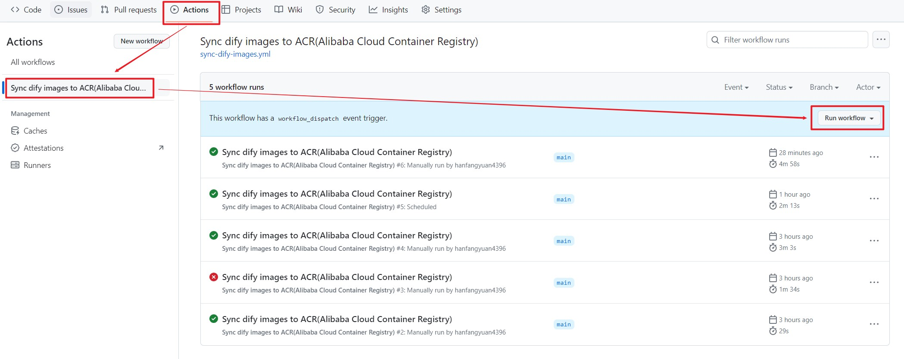

# dify-image-mirror

## 1. 简介

使用github workflow定时自动从docker hub拉取dify依赖的docker镜像，然后上传到阿里云镜像仓库ACR(Alibaba Cloud Container Registry)，目前是每4小时同步一次镜像，同步的镜像列表如下：
- langgenius/dify-api:latest
- langgenius/dify-web:latest
- postgres:15-alpine
- redis:6-alpine
- semitechnologies/weaviate:1.19.0
- langgenius/dify-sandbox:latest
- ubuntu/squid:latest
- nginx:latest

## 2. 快速开始

复制本仓库的 [docker-compose.yaml](./docker-compose.yaml) 内容，把其中的"your-acr-namespace"全局替换为我的ACR仓库命名空间"hanfangyuan"，然后再把docker-compose.yaml放到dify/docker目录中，注意目前只支持dify最新版本的镜像，目前latest对应的是v0.6.11版本。

由于我的ACR仓库是个人版，不保证多并发时的可用性，**强烈建议**根据下面的教程**开通自己的ACR仓库**。

## 3. 搭建自己的ACR仓库

### 3.1. 创建ACR示例

请到 [阿里云镜像仓库](https://cr.console.aliyun.com/) 创建自己的ACR实例，可参考视频教程 [如何在8分钟内掌握阿里云容器镜像服务ACR使用？](https://www.bilibili.com/video/BV1KV4y1q7jm/)。在创建过程中请保存好仓库命名空间、用户名和登录密码，获取位置可参考下图:

### 3.2. fork本仓库

fork本仓库，然后在你的仓库中配置secrets变量，用于把dify镜像同步到你个人的ACR仓库。需要配置的变量为**ACR_NAMESPACE**、**ACR_USERNAME**、**ACR_PASSWORD**，分别对应刚刚保存的仓库命名空间、用户名和登录密码。配置方式可参考下图：

### 3.3. 测试workflow

配置完毕后，可以到你的仓库Actions中手动触发workflow，测试能否同步镜像。

### 3.4. 设置命名空间

把docker-comose.yaml中的"**your-acr-namespace**"全局替换为你的ACR仓库命名空间。

## 4. TODO

- [ ] 镜像增加版本号tag
